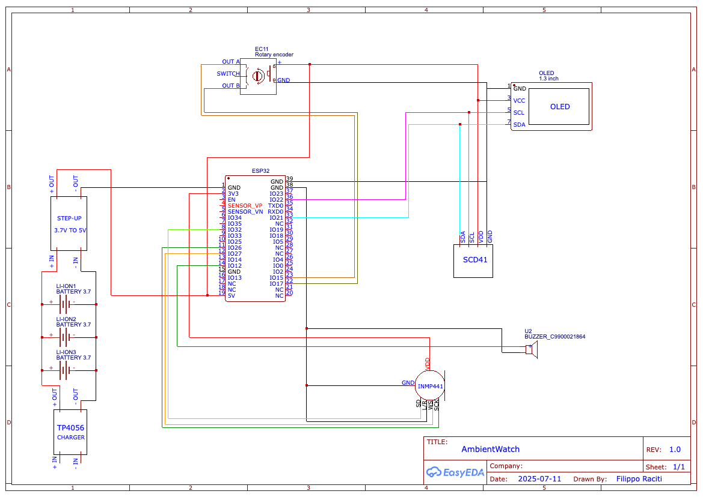
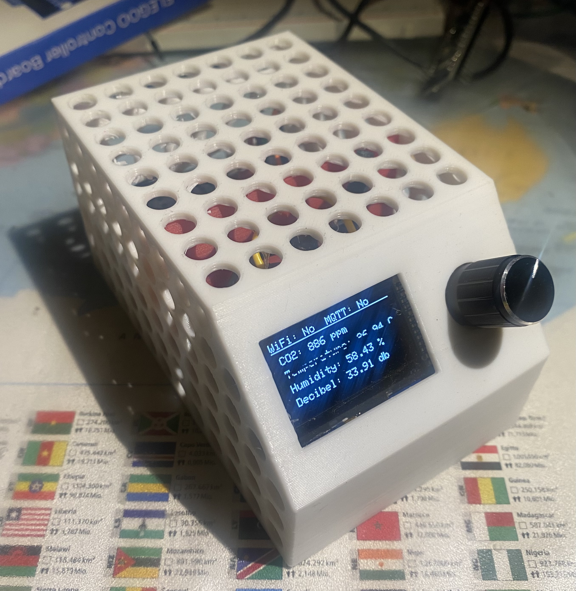
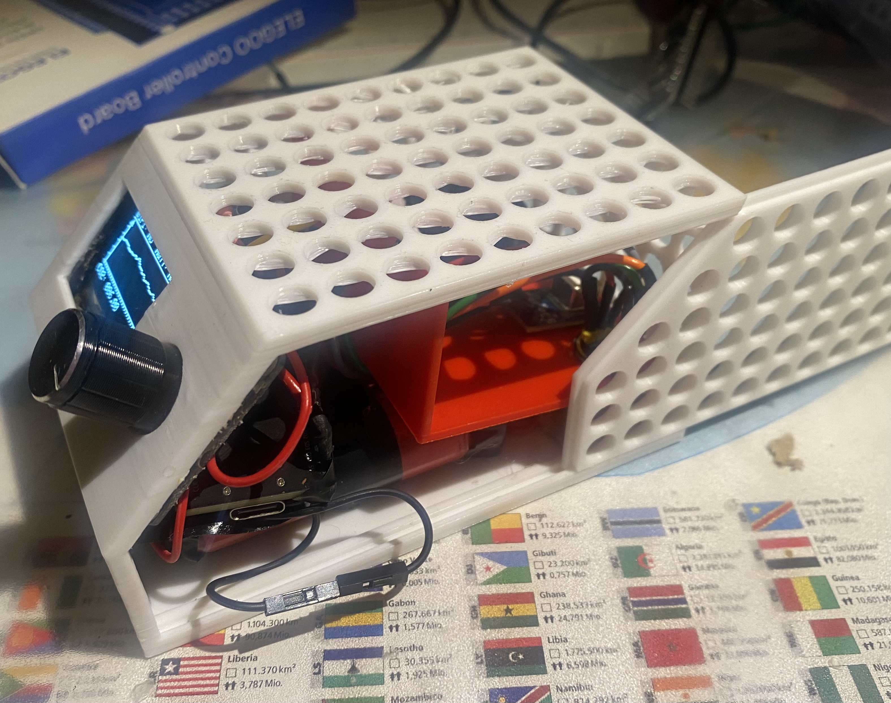
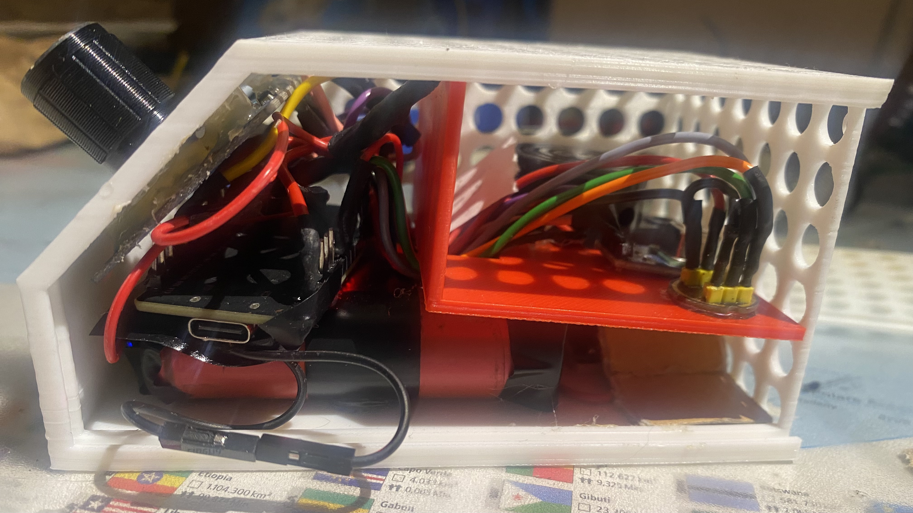
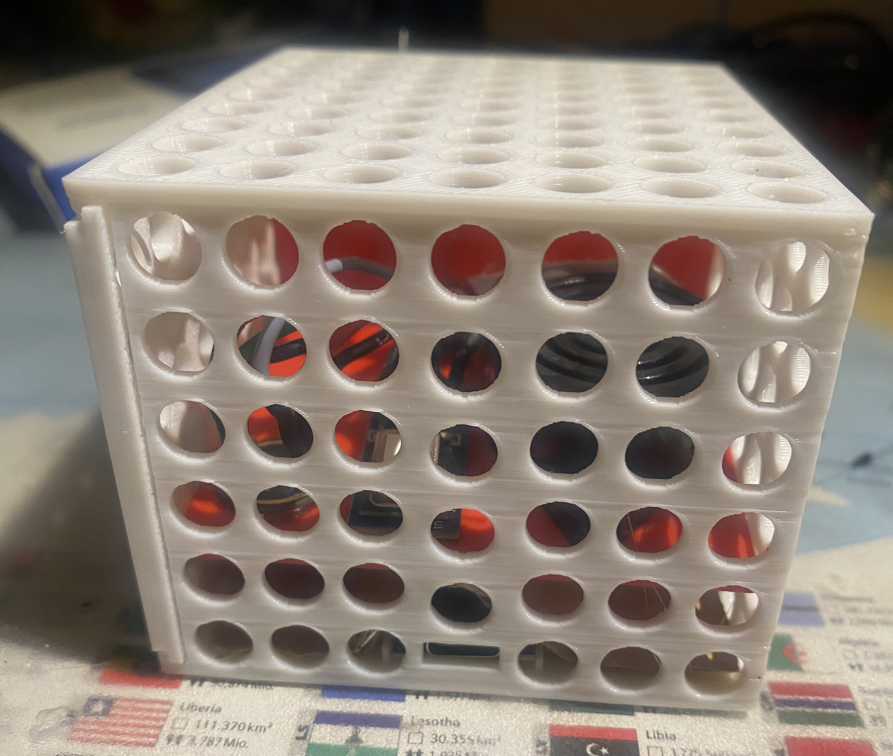

# 📌 AmbientWatch


## 📖 Descrizione
Il dispositivo permette per monitorare vari parametri ambientali (co2, temperatura, umidità, rumore), visualizzarli su un display e li manda su un server MQTT. Il dispositivo è dotato di un buzzer per segnalare eventuali parametri ambientali critici. 

## 🛠️ Hardware utilizzato
- **ESP32**
- **SCD41**: sensore co2, umidità, temperatura
- **INMP441**: microfono
- **SSD1306**: display oled
- **Encoded trigger**
- **Buzzer**
- **Batterie da 3.7V**
- **TP4056**: modulo per caricare le batterie
- **Modulo step-up da 3.7V a 5V**

## 📦 Librerie

```c
#include <Preferences.h>
#include <ESP32Encoder.h>
#include <Wire.h>
#include <Adafruit_SSD1306.h>
#include <Fonts/TomThumb.h>
#include <SensirionI2cScd4x.h>
#include <PubSubClient.h>
#include <WiFi.h>
#include <driver/i2s.h>
#include <Arduino.h>
```

## 🔧 Installazione
⚠️ ATTENZIONE!!! <br>
Il sensore SCD41 potrebbe aver bisogno di essere configurato. Guardare la libreria [SensirionI2cScd4x](https://github.com/Sensirion/arduino-i2c-scd4x/blob/master/src/SensirionI2cScd4x.h) in caso i valori siano sbagliati.

Anche il microfono potrebbe aver bisogno di essere configurato; in questo caso ho impostato la costante `DECIBEL_CALIB_OFFSET` nel file [INMP441.h](AmbientWatch/INMP441.h).

Prima di caricare il firmware, bisogna configurare il WiFi e il server MQTT. Per fare ciò basta rinominare il file nella directory [AmbientWatch](AmbientWatch) da `secrets.h.example` a `secrets.h`, aprire il file e impostare correttamente tutti i parametri richiesti. 

Una volta fatto si può caricare il firmware utilizzando Arduino IDE.

Per quanto riguarda tutti i vari collegamenti, ecco lo schema:




## 🔌 Consumo energetico
Facciamo una stima di quanto tempo duri la batteria per alimentare il sistema in maniera continuativa (consideriamo solamente il caso in cui non risvegli l'esp32 dalla sleep mode, ovvero quando non uso l'encoder rotativo per cambiare la schermata del display)

Io ho usato 3 batterie da 1330 mAh l'una.

Il consumo medio del sistema lo possiamo dividere in due fasi:
- Esp32 non in sleep mode: mediamente consuma 90 mA per ~ 90 s
- Esp32 in sleep mode: consuma 22 mA per ~ 210 s 
Quindi il consumo medio sarà di ((90*90)+(22*210))/300=42.4

Le batterie sono da 1330 mAh l'una e ce ne sono 3 collegate in parallelo --> 3990 mAh

Le batterie erogano una tensione di 3.7V e sono collegate ad uno step-up per alzare e tenere stabile la tensione a 5V. 
Per calcolare il consumo dello step-up dobbiamo calcolare la potenza in uscita necessaria con i 5V, e poi trovare la corrente necessaria con i 3.7V; bisogna tenere in considerazione l'efficienza del modulo (circa del 90%) e il suo consumo fisso (2 mA). Quindi: 

Calcolo potenza in uscita dal modulo:<br>
P_out = 5 V * 0.0424 A ~= 0.212 W

Calcolo potenza in entrata dal modulo (quindi devo aggiungere il 10% dato che ha un'efficienza del 90%):<br>
P_in = 0.212 W + (0.212 W * 10)/100 ~= 0.233 W

Calcolo corrente entrata con 3.7V:<br>
I_in = 0.233 W / 3.7 V ~= 0.063 A ~= 63 mA

Aggiungo il costo costante del modulo di 2mA:<br>
I_totale = 63 mA + 2 mA ~= 65 mA

**Autonomia = 3990 mAh / 65 mA ~= 61.4 h**

## ❌ Problemi noti
- Io ho dovuto collegare il GND dal modulo step-up all'ESP32 direttamente nello spinotto usb dell'ESP32, altrimenti l'ESP32 non riusciva a prendere la corrente necessaria per funzionare.
- Se uso l'encoded trigger mentre esp si trova in light sleep mode, il primo valore catturato dal programma potrebbe non essere quello aspettato; questo accade perchè esp32 si perde delle informazioni per triggerare l'uscita dallo sleep mode e dopo il programma ricomincia a prendere tutti i valori dell'encoded trigger.

## 📸 Foto



